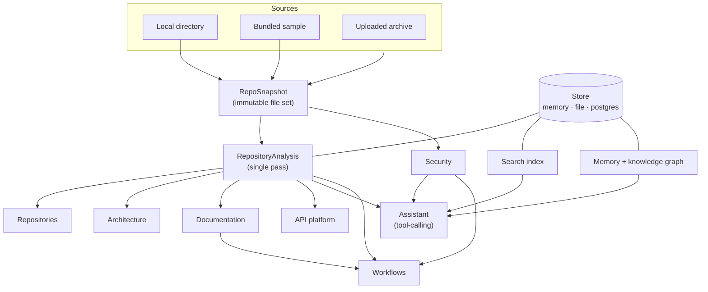

# Architecture

This document explains how ForgeOS is put together and, more usefully, _why_ — including the
choices that were deliberately not made.

## The shape of the system

Data flows one way: **snapshot → analysis → projections**. Nothing downstream re-reads the
filesystem, and no module computes a metric another module also computes. That is the single
decision most responsible for the system's coherence — when two panels disagree about how many
modules a repository has, it is always because they each counted.

## Layers

### `@forgeos/core` — the kernel

Zero runtime dependencies. Not an aesthetic preference: it means the same analysis runs in a Next.js
server component, an edge runtime, a CLI, a Vitest process and (eventually) a plugin sandbox,
without a build step per target. The only module that imports Node built-ins is `fs/node.ts`, which
is why it is exported from a separate subpath (`@forgeos/core/node`) rather than the barrel.

Every engine is a pure function of its input. There are no mocks in the test suite because there is
nothing to mock.

| Area          | Responsibility                                                                                                   |
| ------------- | ---------------------------------------------------------------------------------------------------------------- |
| `kernel/`     | `Result`, error taxonomy, ids, hashing, logging with redaction, a small validator, semver, text utilities, JSONC |
| `fs/`         | Snapshots, gitignore-compatible matching, breadth-first scanning with limits                                     |
| `analysis/`   | Languages, complexity, imports, manifests, stack, environment, debt, and the orchestrator                        |
| `graph/`      | Module graph, Tarjan SCC, layering, Mermaid rendering, schema and route extraction                               |
| `security/`   | Secrets, insecure patterns, advisories, consolidated reporting                                                   |
| `docs/`       | Grounded document generation                                                                                     |
| `search/`     | BM25 index                                                                                                       |
| `memory/`     | Embeddings, hybrid retrieval, knowledge graph                                                                    |
| `ai/`         | Provider abstraction, local provider, OpenRouter, registry, assistant                                            |
| `eval/`       | Reproducible benchmark harness                                                                                   |
| `workflow/`   | Safe expressions, DAG engine                                                                                     |
| `api/`        | OpenAPI modelling, mock server, code generation                                                                  |
| `automation/` | Conventional commits, changelogs, pull-request review                                                            |
| `plugins/`    | Manifests, permissions, registry                                                                                 |

### `@forgeos/db` — persistence

One `Store` interface, three implementations. The in-memory store is the reference implementation;
the file store inherits from it and adds atomic, coalesced writes; the PostgreSQL store is
independent and is checked against the same behaviour.

Every read takes a `workspaceId` as a mandatory argument, so a missing tenant filter is a compile
error rather than a data leak found in production. PostgreSQL additionally enables row-level
security so a wrong query returns nothing instead of everything.

### `apps/web` — the application

Next.js App Router. Server components read the store directly; there is no client-side data layer to
keep in sync. Mutations post to a route handler and then call `router.refresh()`, which re-runs the
server components — one source of truth rather than two.

Every route handler is wrapped by `route()`, which applies authentication, workspace scoping, rate
limiting, error shaping and audit logging in one place. A new endpoint cannot forget them.

## Decisions worth explaining

### The offline provider is not a stub

`forge-local` is a deterministic, retrieval-grounded responder: it ranks the passages it was given
against the question and arranges the best ones. It is **not** a language model and the product
never claims otherwise. It exists so that the application has no dead ends without an API key —
every button works, nothing costs money, results are reproducible — and because a system that
answers only from supplied context cannot hallucinate a deployment procedure.

### Analysis is pattern-based, not AST-based

Shipping a parser per language would be more precise and would also mean shipping a parser per
language. The chosen approach strips comments and string literals — which removes essentially all
the false positives — and counts tokens on what remains. Two things make this honest:

1. The output is used for _ranking_, where ±1 on a complexity count is far inside the noise floor.
2. Where a technique genuinely cannot work, the code returns nothing rather than guessing.
   `extractFunctions` returns an empty list for languages without a pattern, because a wrong
   function boundary produces a misleading hotspot, which is worse than no hotspot.

Tree-sitter can be introduced behind the existing interfaces later without touching any caller.

### Scores are saturating, not linear

Both the health score and the security posture map severity-weighted findings per thousand lines
through a saturating curve. A linear penalty drives every real-world repository to zero, which makes
the number useless for comparison. Across the repositories in the README the health score spans
26–79 — a usable range.

### Retrieval is hybrid because the two methods fail oppositely

Lexical search misses paraphrase. Vector search misses exact identifiers — catastrophic in a
developer tool where the query is often a literal function name. The two are run independently and
fused with reciprocal rank fusion, which sidesteps the fact that a BM25 score of 8 and a cosine of
0.4 cannot meaningfully be added.

### The workflow expression language is deliberately tiny

Workflows are user-authored content that executes on the server. `eval` or `new Function` would hand
arbitrary code execution to anyone with edit access to a workspace. The grammar supports path
lookups, literals, comparisons and boolean combinators — nothing can call a function, reach a
global, or loop.

## Security model

| Surface                     | Control                                                                                                                                                       |
| --------------------------- | ------------------------------------------------------------------------------------------------------------------------------------------------------------- |
| Repository paths            | Resolved and checked against `FORGEOS_SCAN_ROOT`; symlinks that escape the root are refused                                                                   |
| Workflow HTTP and MCP nodes | Private, loopback and link-local destinations are blocked, so a workflow is not an SSRF primitive                                                             |
| Tool dispatch               | The assistant looks tool names up in a host-built registry; an unknown name is a loud failure, never a dynamic property access                                |
| Tool output                 | Inserted as `tool` messages beneath an explicit instruction that it is data; instruction-shaped content is surfaced to the user rather than silently stripped |
| Secrets in reports          | Only a redacted preview is ever stored or returned                                                                                                            |
| Logs                        | Secret-looking keys are redacted before reaching any transport                                                                                                |
| Multi-tenancy               | `workspaceId` is required on every store read; PostgreSQL adds row-level security                                                                             |
| Rate limiting               | Per user and path, with analysis and evaluation limited hardest                                                                                               |
| Errors                      | 5xx responses never echo internal detail to the client                                                                                                        |

## Performance

- **Breadth-first scanning.** When limits truncate a huge repository the sample is spread across the
  tree rather than exhausting the budget inside the first subdirectory.
- **Default ignores first.** Excluding `node_modules`, build output and lockfiles before reading
  anything removes 95%+ of files on a typical project.
- **One pass.** Every module reads the same analysis object.
- **Deterministic ordering.** Files are sorted before analysis, so results are reproducible and
  cacheable by content hash.
- **Bounded work everywhere.** Duplicate detection caps its output, graphs cap their node count for
  rendering, and the assistant caps tool-calling rounds.

## Testing

124 unit and integration tests over the engines, plus 11 end-to-end tests that exercise a real build
with an empty environment. Several tests are explicit regressions for bugs found during development
— the operator double-count, the JSONC comment stripper eating a glob, import extraction running on
string-stripped source, and documentation files leaking into the module graph. Each of those was
found by measurement rather than by review, which is the argument for having the benchmarks and the
`pnpm analyze` script at all.
